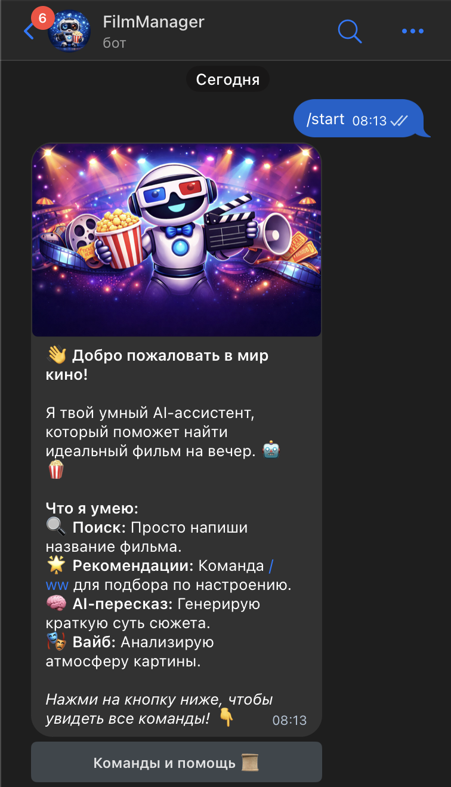

# 🎬 AI Movie Assistant Bot

Умный Telegram-бот, который помогает пользователям находить фильмы, анализировать их атмосферу и получать краткие пересказы сюжетов с помощью нейросетей.

## 📱 Демонстрация главного меню
Бот встречает пользователя стильным приветствием и наглядным списком возможностей.


## 🛠 Использованные технологии и API

### 🌐 TMDB API (The Movie Database)
В качестве основного источника данных о фильмах используется **TMDB API**. 
- **Описание:** Это мощная база данных, предоставляющая доступ к актуальной информации о миллионах фильмов.
- **Роль в проекте:** Используется для поиска фильмов по названию и получения детальных метаданных.

### 🧠 Базовая модель ИИ (LLM)
Для генерации текстового контента используется платформа **OpenRouter**.
- **Модель:** `StepFun Step-3.5-Flash` и `Hunter Alpha`.
- **Роль в проекте:** Генерация кратких пересказов сюжетов и формирование списка рекомендаций по настроению.

### 🎭 Модель Трансформера (NLP)
Для анализа текста и семантического поиска используется библиотека `sentence-transformers`.
- **Модель:** `paraphrase-multilingual-MiniLM-L12-v2`.
- **Тип задачи:** 
  - **Классификация текста (Zero-shot Classification):** Определение «вайба» (атмосферы) фильма.
  - **Семантический поиск:** Поиск похожих по смыслу фильмов на основе их описаний.

## 📂 Структура проекта
```text
.
├── main.py                # Основной файл запуска бота и обработчики команд
├── movie_api.py           # Модуль для работы с TMDB API (поиск и детали)
├── ai_summary.py          # Интеграция с OpenRouter (пересказы и рекомендации)
├── genre_classifier.py    # Классификатор "вайба" фильма на базе NLP-модели
├── recommender.py         # Система поиска похожих фильмов по эмбеддингам
├── requirements.txt       # Список необходимых зависимостей
└── .env                   # Файл с API ключами (не пушится в репозиторий)
```

## ⌨️ Основные команды
| Команда | Описание |
| :--- | :--- |
| `/start` | Запуск бота, вывод приветственного сообщения и главного меню |
| `[Название]` | Просто введите название фильма для получения информации |
| `/ww [запрос]` | Рекомендации "Что посмотреть" (What to Watch) по вашему описанию |
| `/stop` | Завершение сессии и вежливое прощание |

## 🚀 Система контроля версий
- **Git:** Локальное управление версиями (ветки `main`, `version2.0`).
- **GitHub:** Удаленный репозиторий.
- **URL:** [https://github.com/vdxwthy/tgbot_team_project](https://github.com/vdxwthy/tgbot_team_project)

---
*Разработано в рамках учебного проекта по машинному обучению.* 🍿
